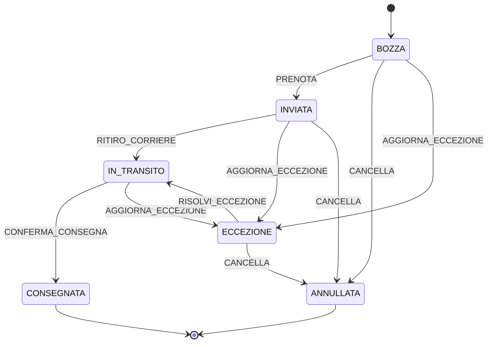

# 🚀 Finite State Machine (FSM) per Gestione Spedizioni

## 📋 Overview

Implementazione robusta di una Finite State Machine (FSM) per gestire il ciclo di vita delle spedizioni, garantendo transizioni di stato valide e prevenendo errori logici a livello applicativo.

## 🎯 Obiettivi

- **Type Safety**: Completa sicurezza dei tipi TypeScript
- **Validazione Stati**: Impedisce transizioni di stato illegali
- **Scalabilità**: Architettura modulare e estensibile
- **Zero Errori**: Elimina stati spazzatura nel database

## 📊 Stati della Spedizione



### Stati Disponibili

| Stato | Descrizione | Transizioni Possibili |
|-------|-------------|----------------------|
| **BOZZA** | Inserimento dati iniziale | PRENOTA → INVIATA<br/>CANCELLA → ANNULLATA<br/>AGGIORNA_ECCEZIONE → ECCEZIONE |
| **INVIATA** | Prenotata con etichetta | RITIRO_CORRIERE → IN_TRANSITO<br/>CANCELLA → ANNULLATA<br/>AGGIORNA_ECCEZIONE → ECCEZIONE |
| **IN_TRANSITO** | In viaggio | CONFERMA_CONSEGNA → CONSEGNATA<br/>AGGIORNA_ECCEZIONE → ECCEZIONE |
| **ECCEZIONE** | Problema logistico | RISOLVI_ECCEZIONE → IN_TRANSITO<br/>CANCELLA → ANNULLATA |
| **CONSEGNATA** | Consegna completata | _Stato terminale_ |
| **ANNULLATA** | Spedizione cancellata | _Stato terminale_ |

## 🛠️ Struttura del Progetto

```
lib/shipment-workflow/
├── shipment-fsm.ts           # Core FSM logic
├── shipment-fsm.test.ts      # Unit tests
├── shipment-operations.ts    # High-level operations
└── README.md                 # Questa documentazione

app/api/spedizioni/
└── prenota/
    └── route.ts              # API endpoint prenotazione

hooks/
└── useShipmentFSM.ts         # React hook per frontend

lib/
├── database.types.ts         # Tipi database Supabase
├── supabase.ts              # Client Supabase
└── services/
    └── corrieri-service.ts  # Integrazione corrieri
```

## 💻 Utilizzo

### Backend - API Route

```typescript
import { transitionShipmentStatus, ShipmentEvents } from '@/lib/shipment-workflow/shipment-fsm';

// Valida e esegui transizione
const newStatus = transitionShipmentStatus(
  currentStatus,
  ShipmentEvents.PRENOTA
);

// Aggiorna database
await supabase
  .from('spedizioni')
  .update({ status: newStatus })
  .eq('id', idSpedizione);
```

### Frontend - React Hook

```typescript
import { useShipmentFSM } from '@/hooks/useShipmentFSM';

function SpedizioneComponent({ spedizione }) {
  const {
    currentStatus,
    availableActions,
    executeTransition,
    isLoading,
    error
  } = useShipmentFSM({
    initialStatus: spedizione.status,
    shipmentId: spedizione.id
  });

  return (
    <div>
      <h2>{getStatusLabel()} {getStatusIcon()}</h2>
      
      {availableActions.map(action => (
        <button
          key={action.event}
          onClick={() => executeTransition(action.event)}
          disabled={isLoading}
        >
          {action.icon} {action.label}
        </button>
      ))}
      
      {error && <Alert>{error}</Alert>}
    </div>
  );
}
```

### Operazioni di Alto Livello

```typescript
import { ShipmentOperations } from '@/lib/shipment-workflow/shipment-operations';

// Prenota spedizione
const result = await ShipmentOperations.prenota(idSpedizione, datiSpedizione);

// Aggiorna tracking
const tracking = await ShipmentOperations.aggiornaTracking(idSpedizione, trackingNumber);

// Cancella spedizione
const cancelled = await ShipmentOperations.cancella(idSpedizione);

// Risolvi eccezione
const resolved = await ShipmentOperations.risolviEccezione(idSpedizione, 'Note risoluzione');
```

## 🧪 Testing

Esegui i test della FSM:

```bash
# Esegui test suite
npm test lib/shipment-workflow/shipment-fsm.test.ts

# O direttamente con Node
node lib/shipment-workflow/shipment-fsm.test.js
```

## 🔐 Sicurezza e Best Practices

1. **Mai bypassare la FSM**: Tutte le transizioni devono passare attraverso `transitionShipmentStatus()`
2. **Validazione Server-Side**: Non fidarsi mai del frontend, validare sempre sul backend
3. **Audit Trail**: Loggare tutte le transizioni per tracciabilità
4. **Rollback su Errore**: Se l'integrazione esterna fallisce, non aggiornare lo stato
5. **Type Safety**: Usare sempre i tipi TypeScript generati da Supabase

## 📈 Metriche e Monitoring

Monitora queste metriche per garantire il corretto funzionamento:

- **Transizioni Illegali Tentate**: Dovrebbero essere 0
- **Tempo Medio per Stato**: Identifica colli di bottiglia
- **Tasso di Eccezioni**: Monitora problemi logistici
- **Completamento Spedizioni**: % di successo

## 🚦 Status Codes API

| Status | Significato |
|--------|------------|
| 200 | Transizione completata con successo |
| 400 | Transizione illegale o dati invalidi |
| 404 | Spedizione non trovata |
| 500 | Errore interno server |

## 🔄 Prossimi Passi

1. **Webhook Corrieri**: Implementare webhook per aggiornamenti automatici
2. **Notifiche**: Sistema di notifiche per cambio stato
3. **Dashboard**: Visualizzazione grafica degli stati
4. **Analytics**: Report e statistiche sulle transizioni
5. **Multi-Corriere**: Supporto per multiple integrazioni

## 📝 Note Implementazione

- La FSM è **single source of truth** per le transizioni di stato
- Stati terminali (`CONSEGNATA`, `ANNULLATA`) non hanno transizioni uscenti
- Ogni transizione può richiedere side-effects (es. chiamate API corriere)
- Il sistema è progettato per essere **fail-safe**: meglio bloccare che corrompere

## 🆘 Troubleshooting

### Errore: "Transizione illegale non permessa"
- Verifica lo stato corrente della spedizione
- Controlla che l'evento sia valido per quello stato
- Usa `ShipmentOperations.canTransition()` per verificare

### Errore: "Stato non gestito FSM"
- Verifica che il database abbia solo stati validi
- Rigenera i tipi TypeScript con `supabase gen types`

### Performance lenta
- Implementa caching per stati frequentemente accessi
- Usa batch operations per aggiornamenti multipli

---

**SCALA O MUORI** - Questa implementazione garantisce scalabilità e affidabilità per gestire migliaia di spedizioni senza errori di stato.